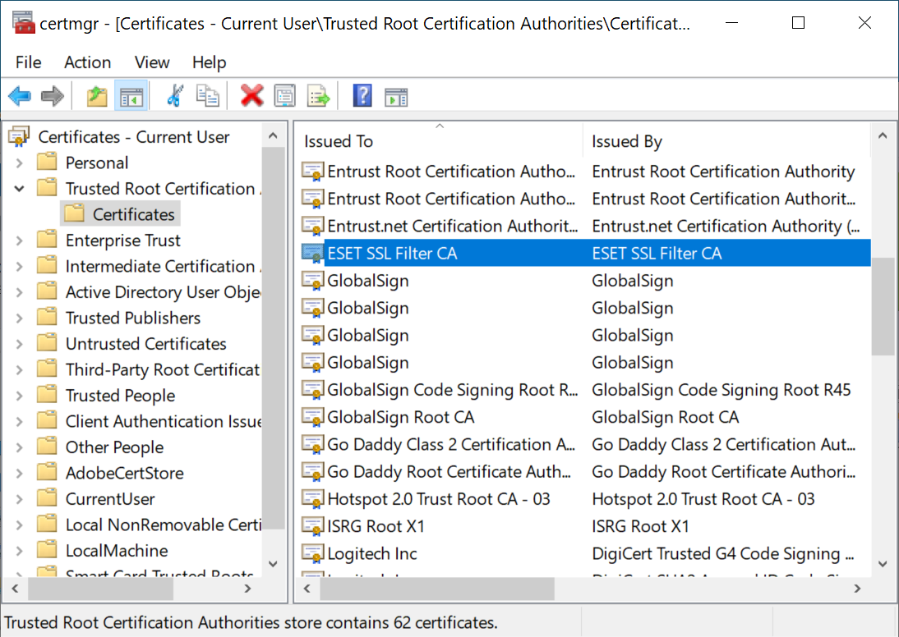

# Introduction

This is _a_ fix for a surprise issue that I've encountered after an update of an ESET product.

For information (and the reason for this repo) check: 
https://forum.eset.com/topic/40702-eset-ssl-protection-produces-an-invalid-certificate-chain-for-nodejs-apps/

## The Problem
ESET started replacing some certificates with their own certificates which are unknown to 
node.  There is presently no real answer from support, no option to set an additional 
certificate in node, nor is there one to use a system/specified trust store.

The easy solution is to turn off the certificate check.  _Let's not call that one an option if 
we can._

We could also disable the ESET feature (but let's avoid that one too).

The solution here is to export the certificate from the Windows certificate store and set it as
an additional certificate for NPM.

# Steps

## Step 1. Setup the Directory
The certificate needs to exist somewhere visible to node.  

For the purpose of this document, let's place it in the user directory: `%USERPROFILE%/certs`.

## Step 2. Export the ESET certificate

1. Open the certificate manager (e.g. run `certmgr.msc`)
2. Find the `ESET SSL Filter CA` certificate (or whichever is applicable to your use-case) 
3. Right click, `All Tasks` | `Export...`.  This will open a wizard.
4. Within the wizard, choose to export as PKCS7 with all certificates in the path. 
5. Export to the new folder created in Step 1

## Step 3. Convert the certificate

1. In `cmd` (or equivalent), navigate to the folder created in Step 1.
2. Run `openssl pkcs7 -print_certs -in exported.p7b -out converted.cer`.  Here it is assumed the 
certificate exported in Step 2 is named `exported.p7b`.  Update the script to match your
actual filenames.

### Conversion Issues
Your milage may vary with the above.  

From this [comment](https://github.com/the-last-byte/ESET-NPM-Breakage-Fix/issues/1#issue-2255084754) by @nagyszabi:

The following error or similar has been reported using the above:
`unable to load PKCS7 object
34359836736:error:0909006C:PEM routines:get_name:no start line:crypto/pem/pem_lib.c:745:Expecting: PKCS7`

There have been [reports](https://github.com/the-last-byte/ESET-NPM-Breakage-Fix/issues/1#issuecomment-2068075201) that the following have 
been succesful: `openssl pkcs7 -inform DER -in exported.p7b -outform PEM -out converted.cer`

## Step 4. Store converted certificate in environmental variable

Note that the `\m` in the below command saves the variable in a system, rather than user 
context.  See [setx documentation](https://learn.microsoft.com/en-us/windows-server/administration/windows-commands/setx).

1. In `cmd` (or equivalent), navigate to the folder created in Step 1.
2. Run `setx NODE_EXTRA_CA_CERTS %USERPROFILE%\certs\converted.cer /m` where `converted.cer` 
is the name of the converted certificate from Step 3.

# Notes
## OpenSSL
If you have Git for Windows, then you should have openssl (even if `cmd` cannot find it).

Check the install directory, e.g. `C:\Program Files\Git\usr\bin\openssl.exe`.  Failing that
you may need to install openssl.

